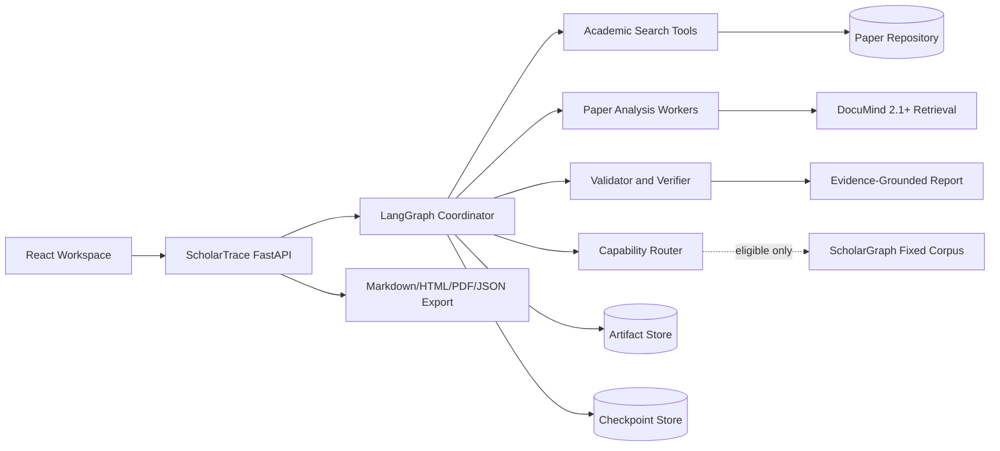

# ScholarTrace 架构设计

> 版本：M10-P4 / 2.0
> 决策状态：本地单用户产品化切片、发布和数据恢复已装配；M10 已以 `PASS WITH NOTES` 冻结

## 1. 架构目标

ScholarTrace 的首要目标不是堆叠 Agent，而是让研究结论满足身份明确、证据可定位、过程可恢复、成本有边界和实验可复现。系统只编排已有能力，不复制 DocuMind 的 RAG 或 ScholarGraph 的 GraphRAG 实现。

## 2. 三套方案比较

| 方案 | 描述 | 开发速度 | 维护成本 | 部署难度 | 结论 |
|---|---|---:|---:|---:|---|
| A. 模块化单体 + 独立工具服务 | ScholarTrace 单后端承载编排和业务数据，通过 HTTP 调用 DocuMind/ScholarGraph | 快 | 中 | 中 | **采用** |
| B. 全微服务 Agent 平台 | 每个 Agent 独立服务，Redis/队列/PostgreSQL/A2A 起步 | 慢 | 高 | 高 | MVP 过度设计，拒绝 |
| C. 单 Agent 脚本 | 一个循环直接搜索、检索和生成，不持久化状态 | 最快 | 低起步、高返工 | 低 | 仅作为 B1 对照，不作为交付架构 |

选择 A 的原因：它保留清晰服务边界和契约测试，同时让单用户 MVP 使用 SQLite、进程内 LangGraph、SSE 和有界本地 worker 即可完成。只有出现可测的跨进程并发或多用户需求，才把本地队列迁移到外部 broker，并评估 PostgreSQL。

## 3. 逻辑架构



## 4. 运行流程

1. FastAPI 创建 task_id 和初始 ResearchPlan；
2. Coordinator 通过 interrupt 等待审批；
3. Search Agent 查询 arXiv/OpenAlex/Crossref 并保存快照；
4. 归一化服务生成 canonical_paper_id 和版本关系；
5. `Send` 为选中论文创建有并发上限的 Worker；
6. Worker 合法获取全文、入库 DocuMind，并按单文档契约检索；
7. Citation Agent 从书目 API 获取显式引用边；
8. Validator 检查 ID、哈希、页码、Chunk、数值和版本；
9. Verifier 判断 Claim 是否受 Evidence 支持；
10. 若存在关键缺口，在预算内最多定向补查一轮；
11. Synthesis 只使用通过门禁的 Claim 生成报告；
12. Artifact、事件和 RunManifest 持久化，前端通过 SSE 展示进度。

## 5. 模块职责

```text
src/scholartrace/
├─ agents/             # 只负责决策与结构化输出
├─ graph/              # LangGraph 构建、路由、Reducer、恢复
├─ scholargraph/       # ScholarGraph 契约、Client、能力路由和 B3/B4 评测
├─ integrations/       # 其他学术 API 与工具服务 Client
├─ schemas/            # Pydantic 业务对象与 API 对象
├─ services/           # 归一化、预算、证据校验、报告
├─ repositories/       # SQLite/Artifact Store 抽象
├─ api/                # Research Task API 和 SSE
└─ observability/      # 安全日志、事件、指标、Trace
```

M0 建立 `contracts.py` 和核心契约；M1 已实现 `src/scholartrace/search/`；M2 已实现 `src/scholartrace/evidence/`；M3 已实现 `src/scholartrace/workflow/` 的可恢复编排；M4 已实现 `src/scholartrace/citations/` 与 `src/scholartrace/verification/`；M5 已实现 `src/scholartrace/scholargraph/` 的严格 Consumer、Capability Router 和配对评测器；M6 另行实现 `src/scholartrace/delivery/` 的任务元数据、脱敏报告、导出和 B0-B4 交付矩阵，`src/scholartrace/api/app.py` 装配 Research Task API，`frontend/` 提供 React + Vite 工作台；M10-P1 在 `src/scholartrace/delivery/queue.py` 增加单进程有界 worker、协作式取消和停机 drain；M10-P2 在 `src/scholartrace/api/security.py` 增加回环/可信私网部署模式和最小 Bearer 认证；M10-P3 在 `src/scholartrace/evidence/live.py` 增加受限公开 arXiv acquisition 与 DocuMind ingest/retrieve 闭环；M10-P4 在 `src/scholartrace/operations/` 增加 SQLite 快照、版本化清单、受保护恢复和确定性本地发布包。

### 5.1 M1 搜索数据流

```text
SearchRequest
  -> source adapter + per-source AcademicHttpClient
  -> SourceSearchResult + request audit
  -> conservative normalization / version links
  -> deterministic relevance ranking
  -> SearchSnapshot + candidate-set hash
  -> deterministic or local-Qwen B0/B1
  -> RunManifest
```

各来源共享错误语义但不共享请求预算。缓存键只包含公开 URL 和公开参数，API Key、联系邮箱等私有参数既不写缓存，也不进入审计记录。单源失败保留结构化错误并允许其他来源继续；所有必选来源都失败或没有达到最低相关性 `4.0` 的论文时，流水线失败关闭。

### 5.2 M2 证据数据流

```text
Paper + DocuMindBinding
  -> readiness + bounded parallel single-document RetrieveRequest
  -> all-paper retrieval barrier
  -> identity / source / hash / rank validation
  -> bounded Chunk aliases (chunk-1..6, quote-1..6)
  -> bounded parallel local-Qwen PaperAnalysisDraft
  -> deterministic alias resolution to original Chunk and exact quote
  -> PaperCard + Claim + fulltext Evidence
  -> three-to-five-paper Markdown report
  -> retrieval audits + model usage + budget + RunManifest
```

模型不会回写长 SHA-256 或复制原文 quote。它只选择本次单论文输入中的短引用；Consumer 将短引用映射回真实 `chunk_id` 和受信 Chunk 文本，并计算 quote hash、字符偏移与确定性 ID。这样把概率性的内容理解和确定性的 provenance 校验分离。检索与生成之间设置全局阶段屏障，避免单 GPU Ollama 在 `qwen3-embedding` 与 `qwen3:8b` 间交错换模造成超时。

### 5.3 M3 编排数据流

```text
injectable Coordinator -> immutable draft plan Artifact
  -> interrupt approval / modification / rejection
  -> adaptive search rounds -> immutable SearchRound Artifact
  -> coverage / saturation / round / budget stop
  -> LangGraph Send -> bounded idempotent Paper Workers
  -> deterministic ArtifactRef reducer -> final control state
```

Checkpoint、Artifact Store 和 Runtime Ledger 使用三个独立 SQLite 文件。Checkpoint 只保存控制面状态；完整计划、检索轮次和 Worker 输出写入 Artifact Store；预算 effect 和业务事件写入 Runtime Ledger。所有可重放写入使用稳定 key，同进程重复 Worker 投递在执行前按 effect key 加锁，跨恢复则由 Artifact/预算唯一键去重。

## 6. 技术栈冻结

| 层 | 选择 | M0 结论 |
|---|---|---|
| Python | CPython 3.11 | 锁定 `.python-version=3.11`，与上游一致 |
| 依赖 | uv + pyproject + uv.lock | 锁文件是精确版本证据 |
| 编排 | LangGraph 1.2.11 + SQLite Checkpoint 3.1.1 | Send、interrupt、严格 MessagePack、持久恢复和事件流通过 |
| 类型 | Pydantic 2.13.4 | 拒绝额外字段并导出 JSON Schema |
| API | FastAPI 0.141.1 | 与 ScholarGraph 锁文件对齐；后续生成 OpenAPI |
| 本地模型 | Ollama `qwen3:8b` / Q4_K_M | 高频、低风险、可复核结构化任务；M0 实机 smoke 通过 |
| API 模型 | `api-strong` Profile | 用户确认 Provider/版本/价格前保持禁用并 fail closed |
| HTTP | HTTPX AsyncClient | M1 来源 Client 与 M2 DocuMind Consumer 均已实现有界请求和错误分类 |
| 数据 | 分离的 SQLite Checkpoint + Artifact Store + Runtime Ledger | M3 恢复、幂等 Artifact、预算 effect 和业务事件已落地 |
| 引用图 | NetworkX | M4 小规模确定性图，不提前引入 Neo4j |
| 前端 | React + TypeScript + Vite | M6 实现结构化工作台 |
| 流式 | SSE | 持久事件支持 `Last-Event-ID` 补发；M10-P0 已实现显式 follow、heartbeat、终态关闭和前端连接状态 |
| 测试 | Pytest、RESPX、Playwright | 按阶段引入，外部调用默认 Fixture |
| 质量 | Ruff + Mypy | M0 起作为本地门禁 |

## 7. 状态与持久化

LangGraph State 只包含 task_id、question、计划引用、已选论文 ID、ArtifactRef、预算计数、轮次和状态。完整 Paper、Evidence、Claim、Verification、工具原始结果和报告写入业务仓库。

Reducer 只做以下操作：

- ID 集合去重合并；
- ArtifactRef 追加并按 ID 去重；
- 预算使用量由单一预算服务原子更新；
- 状态枚举按显式路由变更。

节点可能在 interrupt 恢复后从头执行，因此任何写入都使用确定性幂等键。外部只读查询可以重试，写入和费用调用必须先检查已有执行记录。

M10-P4 将在线交付数据根固定为 `SCHOLARTRACE_DATA_DIR`。当前 API 使用
`tasks.sqlite` 保存任务、幂等键和报告/工件 BLOB，使用 `runtime.sqlite` 保存事件和预算 effect。
备份递归包含数据根内允许的 SQLite，因此显式放入该根的 M3 checkpoint、Artifact Store、
Runtime Ledger 和 binding 也可被纳入；仓库 `artifacts/` 下的开发 smoke 数据不自动进入产品备份。

## 8. 可靠性和降级

| 故障 | 行为 |
|---|---|
| 单个学术来源 429/5xx | 该来源有界退避，其他来源继续，RunManifest 标记 degraded |
| DocuMind stale index | fail closed，刷新绑定后重新审批或重新入库 |
| DocuMind 无 Chunk | 记录成功空结果，不触发 LLM 猜测 |
| ScholarGraph 越界 | Capability Router 确定性跳过，回退 B3 |
| ScholarGraph 超时 | 丢弃部分答案，记录 timed_out，回退 B3 |
| ScholarGraph 契约漂移/错误信封非法 | Consumer fail closed，记录 protocol_error，回退 B3 |
| Worker 失败 | 隔离到单篇论文，保留其他 Worker Artifact |
| 预算耗尽 | 停止新增调用，保存已有结果并生成限制说明 |
| API Profile 未配置 | Coordinator/关键 Verifier/Synthesis 不执行，不静默换模型 |
| Checkpoint 恢复 | 幂等键阻止重复入库、Artifact 和费用记录 |
| trusted_private 缺少或弱 token | 启动直接失败；不降级为未认证私网服务 |
| 浏览器 SSE/report 无法设置 Authorization | 仅允许对应 `GET` 使用 `access_token` 查询参数；其他路径拒绝，代理访问日志关闭 |
| 活跃 SQLite/WAL 需要备份 | SQLite Backup API 生成一致快照；升级前仍先 drain 并停止 API |
| 备份损坏或版本不匹配 | hash、quick_check、表计数、Schema 和精确程序版本任一不符即拒绝恢复 |

## 9. 安全边界

- 论文正文、摘要和工具输出均视为不可信数据；
- Prompt 明确分隔数据，不执行论文中的指令；
- 服务只暴露白名单字段，不透传内部路径、容器日志或向量 metadata；
- `.env`、API Key、模型原始回答、全文和运行数据不进入 Git；
- 错误响应提供公开 code 和 request_id，不暴露堆栈；
- 默认 Compose 端口绑定 `127.0.0.1`；`trusted_private` 只表示共享密钥的可信私网单用户边界，不提供账号、租户隔离或公网安全；
- 任务、事件、工件和报告均受最小 Bearer 认证保护；health 端点保持可探测；应用日志不写 Authorization 或查询串；
- M2 核心流水线不提供通用论文 acquisition；M10-P3 acquisition 仍只允许 Fixture 锁定的版本化公开 arXiv URL，并限制 PDF 类型、大小、重定向和最终域名。出版社/机构仓储来源、许可判断和断点续传仍未实现。
- ScholarTrace 备份不复制 `.env`、原始 PDF、DocuMind 注册表、Milvus 数据或 Ollama 模型；跨服务灾备必须分别执行并验证。

## 10. 风险

| 风险 | 触发信号 | 应对 |
|---|---|---|
| 上游契约漂移 | 版本/字段与 M0 不一致 | 启动 fail fast，契约升级走 Provider/Consumer 流程 |
| 论文身份错误合并 | 标题相似但作者/DOI 冲突 | 保守保留两条并进入人工复核 |
| 摘要被当全文 | ScholarGraph 结果进入 fulltext Evidence | Schema 与 Validator 双重拒绝 |
| 状态膨胀 | Checkpoint 含 Chunk/正文 | 只允许 ArtifactRef，状态大小回归测试 |
| 成本失控 | 查询或补查循环持续增长 | Budget Policy 和最大一轮 FollowUp |
| 评测泄漏 | 开发主题进入盲测调参 | 开发与评测主题分离，记录快照和 Prompt hash |
| 误覆盖可用数据 | 恢复只允许不存在的新目录，全部验证后由操作者显式切换 |

## 11. 演进门槛

- PostgreSQL：SQLite 出现可复现的并发写或查询瓶颈；
- Redis/队列：需要跨进程 Worker 且进程内恢复不足；
- Neo4j：图达到数万节点且 NetworkX 无法满足在线查询；
- MCP：需要让外部 Agent 客户端复用工具服务；
- 动态 GraphRAG：固定语料 B4 已证明收益，且新语料有独立预算和评测。

## 12. M4 引用与核验实现

M4 将引用图与证据核验拆成两个独立可靠性层：

```text
OpenAlex explicit references
  -> normalize citation candidates
  -> relevance/access/acquire/DocuMind ingest/analyze gate
  -> NetworkX citation graph
  -> deterministic Evidence Validator
  -> profile-gated semantic Verifier
  -> report claim gate
  -> at most one budgeted FollowUpRequest
```

- 引用边固定为 `citing -> cited`，来源响应、请求 ID 和响应 hash 可追溯；缺少引用列表或目标元数据时标记 partial，不补造边；
- 新引用论文只能顺序通过六个生命周期阶段，未完成 DocuMind ingest 不能分析，未完成分析不能核验；
- NetworkX 负责有向图、弱连通分量和社区；PageRank 使用无 NumPy/SciPy 的有界确定性幂迭代；
- Validator 在任何语义调用前检查 Claim-Evidence 引用、Paper/Binding/版本、内容和 Chunk hash、页码、字符范围、数值与要求的显式引用边；
- 生产 Verifier 必须匹配 `critical_verifier` Profile；`api-strong` 禁用时 fail closed，测试 Fixture 以独立 `fixture` 类型标识；
- unsupported Claim 不进入报告，partially_supported/conflicted Claim 必须带可见标记；FollowUp 全局最多一个且固定为第 1 轮、最多 1 个追加查询。

## 13. M5 ScholarGraph 能力受限数据流

```text
Research question + declared scope + remaining Budget
  -> frozen CapabilitiesResponse
  -> deterministic Capability Router
  -> skip/reject and B3 fallback, or one bounded query
  -> strict Provider 1.2.0 response validation
  -> abstract-only auxiliary context
  -> paired B3/B4 evaluation record
```

- 路由先检查主题、2020-2025 年份、abstract 证据等级、全文核验需求、索引写入、方法用途和预算；
- Basic 为默认，Local 只服务实体邻域；Global/DRIFT 在 M5 不在线开放；
- GET 健康/能力/指标探针最多两次，昂贵 POST 查询不自动重试，避免重复本地推理；
- 所有 Provider 答案都标记为 abstract-only，不能生成 fulltext Evidence；
- B3/B4 评测要求问题集、模型、论文池、预算和报告限制完全一致；正式盲审显示 eligible 平均质量增益为 0 且 B4 延迟更高，因此 ScholarGraph 保持默认关闭。

## 14. M6 交付数据流

```text
POST task -> waiting_approval -> approve/modify/reject
  -> durable task metadata + Runtime Ledger events
  -> bounded local queue -> deterministic delivery demo or explicit production-unavailable degradation
  -> sanitized JSON/Markdown/HTML/PDF artifacts
  -> React Workspace and SSE replay
```

- M6/M10 API 只暴露任务状态、阶段、计数、降级原因和工件 hash；不把论文正文、Prompt、模型原始回答或凭据写入导出；
- 本地 queue 只提供单进程、有界容量、协作式取消和优雅停机；`health/ready` 暴露快照，跨进程一致性与多用户隔离仍未提供；
- 相同 `Idempotency-Key` 且请求体相同不会重复创建任务；工件内容 hash 冲突 fail closed；
- Docker Compose 将 API 与 UI 分离，M6 数据卷仅保存本地任务元数据和交付工件；
- M6 B0-B4 矩阵记录已评分的 B3/B4 质量证据和无明确收益结论；交付状态 `delivery_ready_with_notes` 不等价于 B4 质量通过。

## 15. M10-P4 备份与恢复数据流

```text
drain queue + stop API
  -> discover allowed SQLite under SCHOLARTRACE_DATA_DIR
  -> sqlite backup snapshot + quick_check + table counts
  -> SHA-256 manifest + deterministic ZIP members
  -> restore into new sibling directory
  -> size/hash/quick_check/table-count verification
  -> explicit SCHOLARTRACE_DATA_DIR cutover + health checks
```

- `*-wal`/`*-shm` 不按普通文件复制，避免得到与主库不一致的快照；
- 清单只记录逻辑相对路径，不暴露源机器绝对路径；
- 版本不匹配时 fail closed；当前没有自动数据库迁移器；
- 恢复目录切换失败时保留旧数据目录，可直接切回旧发布包和旧路径；
- 源代码发布 ZIP 与数据备份 ZIP 是两种不同工件，均不提交到 Git。

## 恢复与资源隔离约束

以下为工作流设计约束，不代表本快照已实现全部运行能力；实现状态以对应版本的基线报告为准。

- interrupt 恢复必须复用同一 `thread_id` 和 `Command(resume=...)`；节点可能从头重放，interrupt 前的副作用必须幂等，不能任意重排同节点的 interrupt。
- `task_id` 与 Checkpointer 的 `thread_id` 分别保存；Checkpoint 只存控制状态与 Artifact 引用，并设置保留策略，不能无界累积全文。
- 论文 Worker、学术 API、DocuMind、ScholarGraph 和模型分别设定并发、超时与重试上限；不能用一个全局并发值替代各服务的资源边界。
- 引用图使用来源明确的论文引用边，GraphRAG 的生成式语义关系不能替代这些边；图指标只是筛选信号，高引用不等于高质量。
- 预算和停止条件由确定性策略执行；模型不得自行扩大费用、调用数、语料范围或工具权限。具体上限遵循本版本的数据契约与模型策略。
