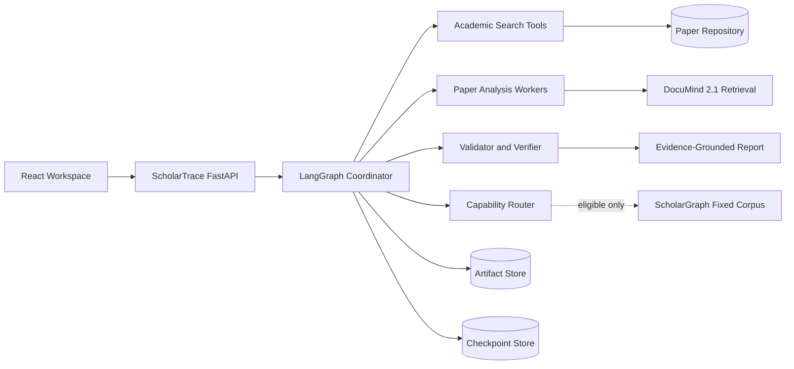

# ScholarTrace 架构设计

> 版本：M0 / 1.0  
> 决策状态：核心路线已冻结，业务实现从 M1 开始

## 1. 架构目标

ScholarTrace 的首要目标不是堆叠 Agent，而是让研究结论满足身份明确、证据可定位、过程可恢复、成本有边界和实验可复现。系统只编排已有能力，不复制 DocuMind 的 RAG 或 ScholarGraph 的 GraphRAG 实现。

## 2. 三套方案比较

| 方案 | 描述 | 开发速度 | 维护成本 | 部署难度 | 结论 |
|---|---|---:|---:|---:|---|
| A. 模块化单体 + 独立工具服务 | ScholarTrace 单后端承载编排和业务数据，通过 HTTP 调用 DocuMind/ScholarGraph | 快 | 中 | 中 | **采用** |
| B. 全微服务 Agent 平台 | 每个 Agent 独立服务，Redis/队列/PostgreSQL/A2A 起步 | 慢 | 高 | 高 | MVP 过度设计，拒绝 |
| C. 单 Agent 脚本 | 一个循环直接搜索、检索和生成，不持久化状态 | 最快 | 低起步、高返工 | 低 | 仅作为 B1 对照，不作为交付架构 |

选择 A 的原因：它保留清晰服务边界和契约测试，同时让单用户 MVP 使用 SQLite、进程内 LangGraph 和 SSE 即可完成。只有出现可测的跨进程并发或多用户需求，才引入队列和 PostgreSQL。

## 3. 逻辑架构



## 4. 运行流程

1. FastAPI 创建 task_id 和初始 ResearchPlan；
2. Coordinator 通过 interrupt 等待审批；
3. Search Agent 查询 arXiv/OpenAlex/Crossref 并保存快照；
4. 归一化服务生成 canonical_paper_id 和版本关系；
5. `Send` 为选中论文创建有并发上限的 Worker；
6. Worker 合法获取全文、入库 DocuMind，并按单文档契约检索；
7. Citation Agent 从书目 API 获取显式引用边；
8. Validator 检查 ID、哈希、页码、Chunk、数值和版本；
9. Verifier 判断 Claim 是否受 Evidence 支持；
10. 若存在关键缺口，在预算内最多定向补查一轮；
11. Synthesis 只使用通过门禁的 Claim 生成报告；
12. Artifact、事件和 RunManifest 持久化，前端通过 SSE 展示进度。

## 5. 模块职责

```text
src/scholartrace/
├─ agents/             # 只负责决策与结构化输出
├─ graph/              # LangGraph 构建、路由、Reducer、恢复
├─ integrations/       # 学术 API、DocuMind、ScholarGraph Client
├─ schemas/            # Pydantic 业务对象与 API 对象
├─ services/           # 归一化、预算、证据校验、报告
├─ repositories/       # SQLite/Artifact Store 抽象
├─ api/                # Research Task API 和 SSE
└─ observability/      # 安全日志、事件、指标、Trace
```

M0 只建立 `contracts.py` 和契约测试；目录在对应实现阶段按需创建，避免空模块伪装完成度。

## 6. 技术栈冻结

| 层 | 选择 | M0 结论 |
|---|---|---|
| Python | CPython 3.11 | 锁定 `.python-version=3.11`，与上游一致 |
| 依赖 | uv + pyproject + uv.lock | 锁文件是精确版本证据 |
| 编排 | LangGraph 1.2.11 | Send、interrupt、InMemory Checkpoint、事件流 smoke 通过后锁定 |
| 类型 | Pydantic 2.13.4 | 拒绝额外字段并导出 JSON Schema |
| API | FastAPI 0.141.1 | 与 ScholarGraph 锁文件对齐；后续生成 OpenAPI |
| 本地模型 | Ollama `qwen3:8b` / Q4_K_M | 高频、低风险、可复核结构化任务；M0 实机 smoke 通过 |
| API 模型 | `api-strong` Profile | 用户确认 Provider/版本/价格前保持禁用并 fail closed |
| HTTP | HTTPX AsyncClient | M1 引入，独立连接池、超时和错误分类 |
| 数据 | SQLite + Artifact Store 抽象 | 单用户 MVP 足够，正文不进入 Checkpoint |
| 引用图 | NetworkX | M4 小规模确定性图，不提前引入 Neo4j |
| 前端 | React + TypeScript + Vite | M6 实现结构化工作台 |
| 流式 | SSE | 单向进度足够，事件先持久化 |
| 测试 | Pytest、RESPX、Playwright | 按阶段引入，外部调用默认 Fixture |
| 质量 | Ruff + Mypy | M0 起作为本地门禁 |

## 7. 状态与持久化

LangGraph State 只包含 task_id、question、计划引用、已选论文 ID、ArtifactRef、预算计数、轮次和状态。完整 Paper、Evidence、Claim、Verification、工具原始结果和报告写入业务仓库。

Reducer 只做以下操作：

- ID 集合去重合并；
- ArtifactRef 追加并按 ID 去重；
- 预算使用量由单一预算服务原子更新；
- 状态枚举按显式路由变更。

节点可能在 interrupt 恢复后从头执行，因此任何写入都使用确定性幂等键。外部只读查询可以重试，写入和费用调用必须先检查已有执行记录。

## 8. 可靠性和降级

| 故障 | 行为 |
|---|---|
| 单个学术来源 429/5xx | 该来源有界退避，其他来源继续，RunManifest 标记 degraded |
| DocuMind stale index | fail closed，刷新绑定后重新审批或重新入库 |
| DocuMind 无 Chunk | 记录成功空结果，不触发 LLM 猜测 |
| ScholarGraph 越界 | Capability Router 确定性跳过，回退 B3 |
| ScholarGraph 超时 | 丢弃部分答案，记录 timed_out，回退 B3 |
| Worker 失败 | 隔离到单篇论文，保留其他 Worker Artifact |
| 预算耗尽 | 停止新增调用，保存已有结果并生成限制说明 |
| API Profile 未配置 | Coordinator/关键 Verifier/Synthesis 不执行，不静默换模型 |
| Checkpoint 恢复 | 幂等键阻止重复入库、Artifact 和费用记录 |

## 9. 安全边界

- 论文正文、摘要和工具输出均视为不可信数据；
- Prompt 明确分隔数据，不执行论文中的指令；
- 服务只暴露白名单字段，不透传内部路径、容器日志或向量 metadata；
- `.env`、API Key、模型原始回答、全文和运行数据不进入 Git；
- 错误响应提供公开 code 和 request_id，不暴露堆栈；
- 外部 URL 获取在 M2 实现域名、大小、类型和重定向限制。

## 10. 风险

| 风险 | 触发信号 | 应对 |
|---|---|---|
| 上游契约漂移 | 版本/字段与 M0 不一致 | 启动 fail fast，契约升级走 Provider/Consumer 流程 |
| 论文身份错误合并 | 标题相似但作者/DOI 冲突 | 保守保留两条并进入人工复核 |
| 摘要被当全文 | ScholarGraph 结果进入 fulltext Evidence | Schema 与 Validator 双重拒绝 |
| 状态膨胀 | Checkpoint 含 Chunk/正文 | 只允许 ArtifactRef，状态大小回归测试 |
| 成本失控 | 查询或补查循环持续增长 | Budget Policy 和最大一轮 FollowUp |
| 评测泄漏 | 开发主题进入盲测调参 | 开发与评测主题分离，记录快照和 Prompt hash |

## 11. 演进门槛

- PostgreSQL：SQLite 出现可复现的并发写或查询瓶颈；
- Redis/队列：需要跨进程 Worker 且进程内恢复不足；
- Neo4j：图达到数万节点且 NetworkX 无法满足在线查询；
- MCP：需要让外部 Agent 客户端复用工具服务；
- 动态 GraphRAG：固定语料 B4 已证明收益，且新语料有独立预算和评测。

## 恢复与资源隔离约束

以下为工作流设计约束，不代表本快照已实现全部运行能力；实现状态以对应版本的基线报告为准。

- interrupt 恢复必须复用同一 `thread_id` 和 `Command(resume=...)`；节点可能从头重放，interrupt 前的副作用必须幂等，不能任意重排同节点的 interrupt。
- `task_id` 与 Checkpointer 的 `thread_id` 分别保存；Checkpoint 只存控制状态与 Artifact 引用，并设置保留策略，不能无界累积全文。
- 论文 Worker、学术 API、DocuMind、ScholarGraph 和模型分别设定并发、超时与重试上限；不能用一个全局并发值替代各服务的资源边界。
- 引用图使用来源明确的论文引用边，GraphRAG 的生成式语义关系不能替代这些边；图指标只是筛选信号，高引用不等于高质量。
- 预算和停止条件由确定性策略执行；模型不得自行扩大费用、调用数、语料范围或工具权限。具体上限遵循本版本的数据契约与模型策略。
